# 🤖 Local AI Stack

<!-- Badges: Replace with your own -->
<p align="center">
  
  
  
</p>

<!-- Logo: Replace with your own logo -->
<p align="center">
  
</p>

A powerful, self-hosted, and customizable AI stack that runs locally on your machine. This project bundles a suite of best-in-class open-source tools to provide a complete environment for local AI development, experimentation, and workflow automation.

## 📚 Stack Components

This stack uses a combination of pre-built images from Docker Hub and custom-built images.

*   **OpenWebUI**: `kheidencom/openwebui:latest` - The primary user interface for chatting with LLMs.
*   **Ollama**: A custom image that dynamically pulls models listed in `ollama/models.txt`.
*   **n8n**: A custom image that comes pre-loaded with example workflows.
*   **Qdrant**: `qdrant/qdrant` - The official image for the vector database.
*   **PhotoPrism**: `photoprism/photoprism:latest` - The official image for photo management.
*   **MariaDB**: `mariadb:11.4` - The database used by PhotoPrism.

## ✨ Features

*   **Popular Open Source AI Software**: OpenWebUI, n8n, Photoprism, Ollama, Qdrant, and MariaDB.
*   **One-Command Setup**: Get up and running in minutes with a simple setup script for both Linux/macOS and Windows.
*   **Local LLM Inference**: Powered by **Ollama**, allowing you to run powerful open-source language models like Llama 3, Mistral, and more, completely offline.
*   **Flexible Model Management**: Easily customize which LLMs are downloaded by adding them to a simple `models.txt` file.
*   **Rich Web Interface**: Interact with your local models through **OpenWebUI**, a feature-rich and user-friendly chat interface.
*   **Workflow Automation**: Includes **n8n** with a pre-configured "Text Summarization" workflow to demonstrate how to integrate AI into your automated tasks.
*   **Vector Database**: Comes with **Qdrant** for all your Retrieval-Augmented Generation (RAG) and semantic search needs.
*   **Photo Management**: Includes **PhotoPrism**, a comprehensive tool for managing, organizing, and sharing your photo library.


## 🚀 Getting Started

Getting the stack running is as simple as running one command.

1.  **Clone the repository:**
    ```bash
    git clone https://github.com/kheiden-com/ai-stack.git
    cd ai-stack
    ```

2.  **Run the setup script:**

    *   For **Linux or macOS**:
        ```bash
        ./setup.sh
        ```
    *   For **Windows** (in a Powershell terminal):
        ```powershell
        ./setup.ps1
        ```

Note: You may want to update the environment variables in the .env file prior to creating the stack. If you do not have a .env file in your directory before running the setup script, one will be created from the .env.template file.

That's it! The script will check for prerequisites, prepare the necessary configuration files, and launch all the services. It may take a while on the first run as Docker images are downloaded and built.

## 🏗️ Architecture

The stack is designed to be modular, with services communicating with each other over the internal Docker network.

```mermaid
graph TD
    subgraph "User Interaction"
        User("👤 User")
    end

    subgraph "AI Stack Frontend"
        OpenWebUI("[🌐 OpenWebUI<br>Frontend for LLMs]")
    end

    subgraph "Automation Engine"
        n8n("[⚙️ n8n<br>Workflow Automation]")
    end

    subgraph "Core AI Services"
        Ollama("🧠 Ollama<br>Inference Engine")
        Qdrant("📚 Qdrant<br>Vector Database")
    end

    subgraph "Photo Management"
        PhotoPrism("[🖼️ PhotoPrism<br>Photo Management]")
        MariaDB("🗄️ MariaDB<br>Database")
    end

    %% Connections
    User --> OpenWebUI
    User --> n8n
    User --> PhotoPrism

    OpenWebUI --> Ollama
    OpenWebUI --> Qdrant

    n8n --> Ollama

    PhotoPrism --> MariaDB
```



## 🔧 Advanced Usage

### Customizing Ollama Models

You can control which models Ollama downloads by editing the `ollama/models.txt` file. Add one model name per line (e.g., `mistral:latest`). The models will be pulled automatically when the stack starts.

### Managing Your Data

If you have existing data from another setup, you can copy it into the volumes used by this stack.

#### From a Docker Volume

To copy data from an existing Docker volume (e.g., `old_ollama_data`) to this stack's volume (`ollama_storage`), you can run:
```bash
docker run --rm -v old_ollama_data:/from -v ollama_storage:/to alpine sh -c "cd /from ; cp -av . /to"
```

#### From a Docker Image

To copy data from an existing Docker image (e.g., `my-ollama:latest`) into a volume used by this stack, you can run:
```bash
docker run --rm --entrypoint /bin/sh -v ollama_storage:/to my-ollama:latest -c "cp -av /root/.ollama/. /to/"
```

#### Copying Data Between Images

To create a new image by merging data from two existing images, you can use the provided scripts.

*   **Linux/macOS:**
    ```bash
    ./copy_image_data.sh <source_image> <path_in_source> <dest_image> <path_in_dest> <new_image_tag>
    ```
*   **Windows (Powershell):**
    ```powershell
    ./copy_image_data.ps1 -SourceImage <source_image> -PathInSource <path_in_source> -DestImage <dest_image> -PathInDest <path_in_dest> -NewImageTag <new_image_tag>
    ```

## ⁉️ Troubleshooting

*   **Permission Errors on `./setup.sh`**: If you get a "Permission denied" error, run `chmod +x setup.sh` to make the script executable.
*   **Powershell Script Execution Policy**: If `./setup.ps1` fails to run on Windows, you may need to adjust your execution policy. You can set it for the current process by running: `Set-ExecutionPolicy -ExecutionPolicy Bypass -Scope Process`.
*   **Service Failures**: If a service fails to start, check the logs with `docker-compose logs <service_name>` (e.g., `docker-compose logs ollama`).
*   **bind: only one usage of each socket address (protocol/network address/port) is normall permitted.**: If you encounter this error, please make sure that you are not already running the service on the port through another means. For example, if running n8n locally via `npx n8n`, make sure to exit the thread before re-running the ai-stack `setup` script. 

## ❤️ Contributing

Contributions are welcome! If you have ideas for new features, improvements, or bug fixes, please feel free to:
1.  Open an issue to discuss your idea.
2.  Fork the repository and create a pull request.

Please make sure your code is well-documented and follows the existing style.

## 🔮 Future Updates

*   TODO: Add more configuration to the setup so the software is more closely integrated.
